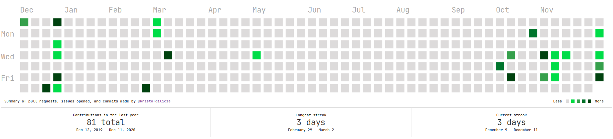

# github-calendar-web-component.js
[](https://www.npmjs.com/package/github-calendar-web-component) [](https://www.npmjs.com/package/github-calendar-web-component)

ES6 **Web Component** wrapper for [GitHub Calendar](https://github.com/Bloggify/github-calendar).



Not all features are exposed, feel free to contribute.


# Installation
```html
# Using npm
npm install --save github-calendar-web-componen

# Using yarn
yarn add github-calendar-web-componen
```

# Usage
```html
<!-- Serve from CDN -->
<script
    src="https://unpkg.com/github-calendar-web-component@0.1.0/dist/github-calendar-web-component.min.js"
    type="module"
></script>


<github-calendar
    username="kristofgilicze"
    summary-text="Override the default summary text"
></github-calendar>
```
## [preview](https://kristofgilicze.github.io/github-calendar-web-component/examples/)
